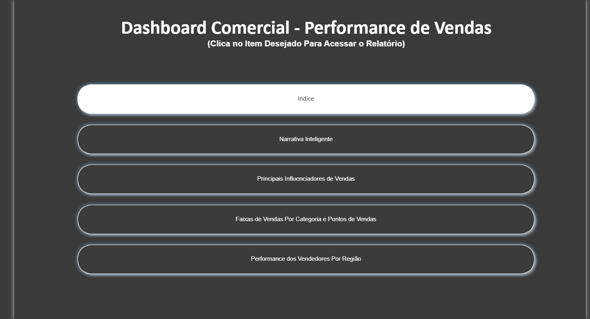
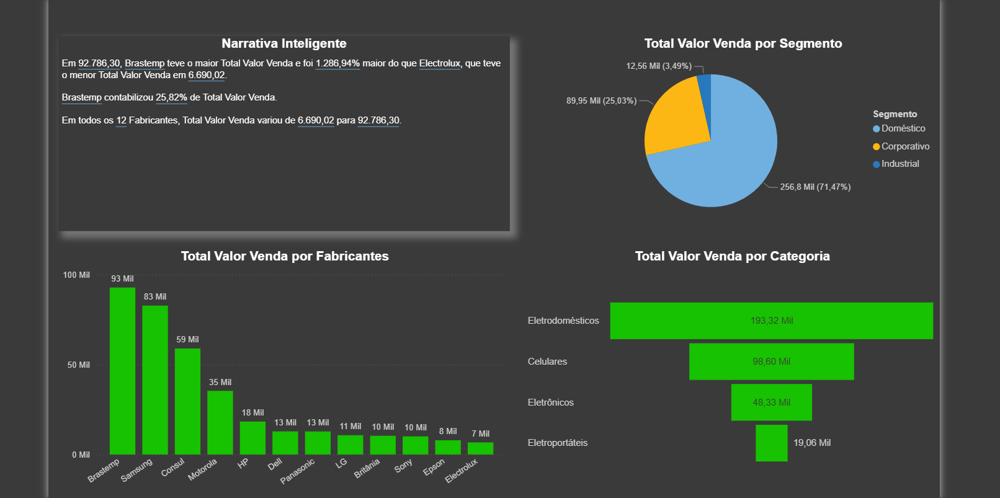
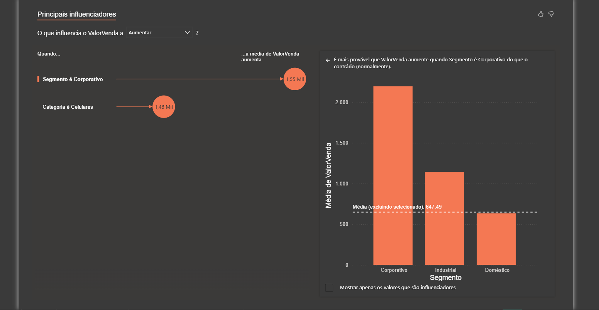
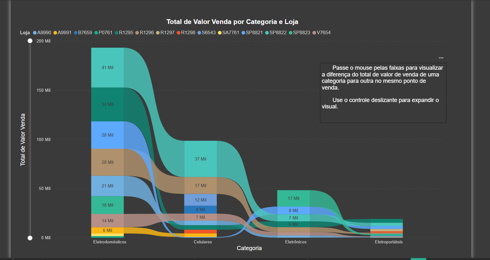
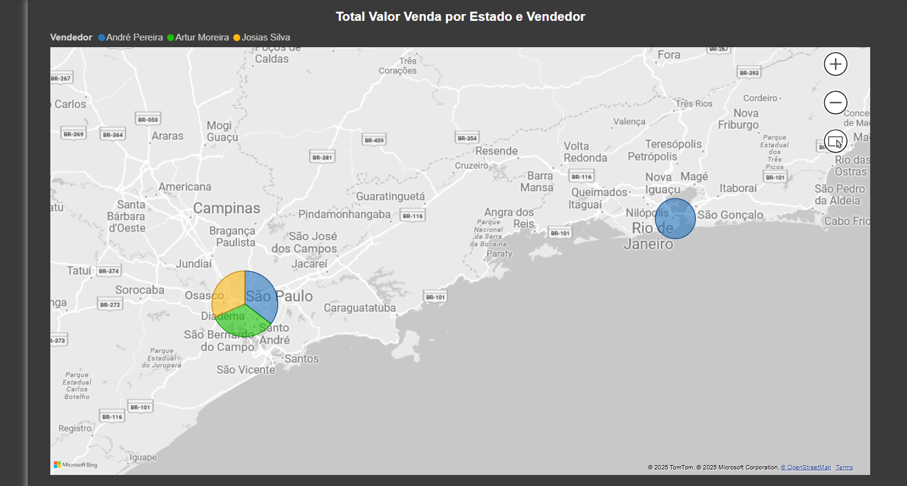

# Dashboard Comercial - Performance de Vendas

Este projeto apresenta um **dashboard comercial** que analisa a **performance de vendas** de uma empresa fictícia utilizando o **Power BI**. 

O objetivo é demonstrar como diferentes indicadores podem ser visualizados e interpretados para apoiar decisões estratégicas na área comercial.

---

## Objetivo do Projeto

- Introduzir conceitos de **análise de dados comerciais** com o Power BI.  
- Construir diversas **visualizações** para compreender a performance de vendas por diferentes ângulos.  
- Explorar funcionalidades do Power BI.

---

## 🗂 Estrutura do Dashboard

O dashboard contém as seguintes abas, cada uma com funcionalidades específicas para analisar a performance de vendas:

---

### 1️⃣ Índice
Menu interativo que permite navegar entre os diferentes relatórios do dashboard.  

---

### 2️⃣ Narrativa Inteligente
Apresenta insights automáticos sobre os dados de vendas, destacando tendências, padrões e informações relevantes.  

---

### 3️⃣ Principais Influenciadores de Vendas
Analisa os fatores que mais impactam os resultados de vendas, ajudando a identificar oportunidades de melhoria.  

---

### 4️⃣ Faixas de Vendas por Categoria e Pontos de Venda
Visualiza as vendas agrupadas por categorias de produtos e pontos de venda, facilitando comparações e análises detalhadas.  

---

### 5️⃣ Performance dos Vendedores por Região
Avalia o desempenho da equipe de vendas em diferentes regiões, permitindo identificar os melhores e os que necessitam de suporte.  

---

## 🛠 Tecnologias Utilizadas

- Power BI  
- Conjuntos de dados fictícios em Excel/CSV  

---

## 🚀 Como Utilizar

1. Baixe o arquivo do dashboard do repositório.  
2. Abra no **Power BI Desktop**.  
3. Explore os gráficos, filtros e menus interativos para analisar a performance de vendas.
